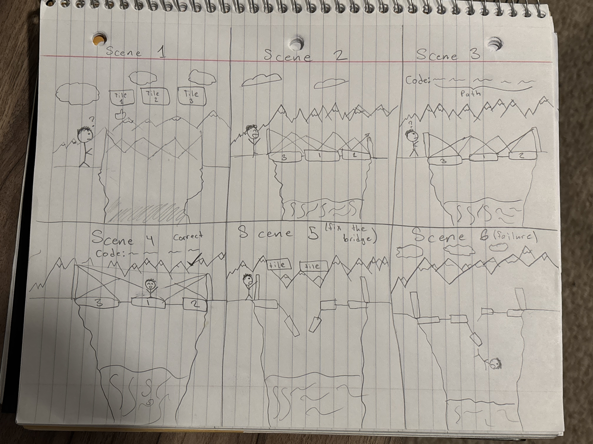
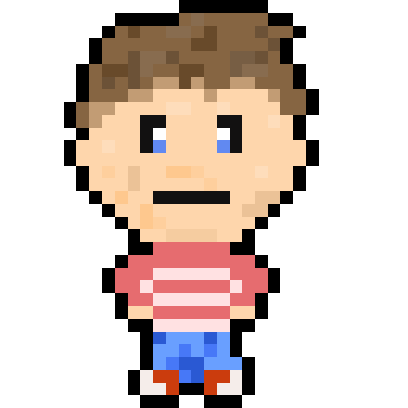

# Linked Lunacy

## Elevator Pitch

Linked Lunacy is a puzzle based educational game where players reorder, identify, traverse, and rewrite chains of nodes to learn how linked lists function through interactive problem solving.

## Influences (Brief)

- Influence #1: Pipes
    - Medium: Video Game
    - Explanation: Pipes is a logic puzzle where you must connect the pipes to create a path that connects all the pipes. Similarly, Linked Lunacy is about building a bridge to connect two sides and using logic to build the bridge.
- Influence #2: Tetris 99
    - Medium: Video Game
    - Explanation: Tetris 99 is about matching and connecting pieces to clear blocks as pieces fall down. The more blocks cleared, the more points earned. Similarly, Linked Lunacy will have bridge pieces that are continuously given to the player and they must use those pieces to connect the bridge. Players lose points or fail when bridge piece nodes are not correctly connected.
- Influence #3: Human Resource Machine
    - Medium: Video Game
    - Explanation: Human Resource Machine teaches programming logic through interactive puzzles rather than lectures. Linked Lunacy follows a similar approach by teaching linked list operations through visual experimentation, mistake correction, and level based challenges.
- Influence #4: Earthbound
    - Medium: Video Game
    - Explanation: The character and art design is meant to be pixel-similar to that of Earthbound to create a warm and fun art style. It also gives the game a more authentic feel and a more inviting atmosphere.

## Core Gameplay Mechanics (Brief)

- Players walk Alex across the bridge using the LEFT and RIGHT arrow keys to land on the tile that answers the current puzzle, then press Submit.
- Players can click and drag a plank to reorder it within the bridge (used in Level 1 to move the largest value to the tail position).
- Players traverse the bridge based on given code statements such as `head->next->next` or `n3->prev->prev` and arrive at the correct tile.
- Bridge tiles represent nodes within a linked list and the ropes between them represent the `next` (and optionally `prev`) pointers.
- In Level 3, players type a single C-style reassignment statement (for example, `curr->next = curr->next->next;`) to mutate the bridge, and the visual structure updates to reflect the typed code.

# Learning Aspects

## Learning Domains

- General Python programming knowledge
- General Typescript/Javascript programming knowledge
- Arrays and data structure purpose
- Computer Science fundamentals
- Data structures and algorithms
- Logical reasoning and problem solving

## Target Audiences

- Novice and Intermediate computer programmers
- Logic puzzle game players
- Users interested in data structures
- Self-taught programmers seeking visual ways to understand abstract programming

## Target Contexts

- Used in a data structure class as in-class learning activity
- An extra resource tool to understand the concepts behind linked lists
- Used as an additional study tool outside of class
- Used in tutoring environments or study groups to reinforce linked list concepts

## Learning Objectives

- Singly and Doubly Linked List Structure: Players will be able to identify what kind of linked list (double or single) is given to them based on the structure
- Linked List Traversal: Students will be able to traverse through a linked list from either the head or tail of the linked list from code statements of "prev" and "next"
- Insertion and Deletion: Students will be able to insert or delete nodes at the beginning, end, or middle of a linked list while keeping the data structure intact and functioning as intended
- Pointer Relationships: Players will be able to identify whether pointer connections between nodes are correct or broken

## Prerequisite Knowledge

- Prior to the game, players should be able to explain the differences and similarities between a linked list and an array
- Prior to the game, players must be able to create and identify the components of objects in either Python, JavaScript, TypeScript, C, C++, or some other programming language that uses objects
- Players should be familiar with basic programming terminology such as variables, objects, and references
- Players should be able to follow simple logical instructions similar to pseudocode

## Assessment Measures

- Given a linked list and statements traversing through the linked list, correctly identify the resulting node (logic)
    - Ex: Identify the result node.

    ```js
    // Linked List
    // head -> [5] -> [8] -> [12] -> null
    let result = head.next.next;
    ```

    - Answer: 12

    - In game scenario: The hiker is standing at the start of the bridge. Follow the correct path using the instructions below to determine where the hiker will end up.
        - Bridge:

        ```js
        [5] -> [8] -> [12]
        ```

        - Instructions: head -> next -> next
        - Player task: Click the bridge tile where the hiker will land.

- Given a node and linked list, insert the node while maintaining the proper linked list structure (rubric)
    - Ex: Insert a node with value 10 between 5 and 8.

    ```js
    // head -> [5] -> [8] -> null
    let newNode = { value: 10, next: null };
    newNode.next = head.next;
    head.next = newNode;
    ```

    - Result: head -> [5] -> [10] -> [8] -> null
    - Grading:
        - New node points to correct next node
        - Previous node connects to correct new node
    - In game scenario: The bridge has a gap! Insert the missing plank so the hiker can safely cross.
        - Bridge:

        ```js
        [5] -> [8]
        ```

        - New given tile: [10]
        - Instructions: Drag the tile into the correct position so the bridge remains properly connected.

- Given a value to delete from a linked list, identify the predecessor tile whose `->next` must be rewired (logic)
    - Ex: Identify which node would need its `next` pointer changed to delete the node with value 8.

    ```js
    // head -> [5] -> [8] -> [12] -> null
    let prev = head;        // node with value 5
    prev.next = prev.next.next; // skip the [8] tile
    ```

    - Answer: The node with value 5 — its `next` pointer is what gets rewired to skip the deleted tile.

    - In game scenario: Walk Alex onto the tile whose `->next` currently points at the target value. That predecessor is what delete-by-value would rewire.
        - Bridge:

        ```js
        [5] -> [8] -> [12]
        ```

        - Instructions: Walk Alex onto the predecessor tile, then press Submit.

- Given a goal stated in English, type a single reassignment statement that performs the operation (rubric)
    - Ex: "Delete the node after `curr` by skipping it."

    ```js
    curr->next = curr->next->next;
    ```

    - Grading:
        - Statement uses reassignment (`=`) and ends as a single line
        - The target on the left-hand side is the pointer the operation should change
        - The right-hand side evaluates to the correct surviving node

    - In game scenario: One plank on the bridge is labeled `curr`. The player types the statement into the input box and presses Submit; if the statement matches the goal pattern, the bridge animates the resulting pointer change.

- Given a linked list structure, identify whether the structure represents a singly or doubly linked list (logic)
    - Ex: Is this singly or doubly linked?

    ```js
    let node1 = { value: 5, next: null, prev: null };
    let node2 = { value: 8, next: null, prev: node1 };
    node1.next = node2;
    ```

    - Answer: Doubly, because nodes have both next and prev, meaning you can move forwards and backwards.

    - In game scenario: Some bridges only allow movement forward, while others allow movement in both directions. Identify which type this bridge is.
        - Bridge:

        ```js
        null <- [5] <-> [8] <-> [12] -> null
        ```

        - Instructions: Select what type of bridge this is:
            1. Singly linked bridge
            2. Doubly linked bridge

# What sets this project apart?

- Provides a visually appealing and fun way to learn linked list
- The game can be played by people outside of the computer science field and be played by people who enjoy logic puzzles
- Offers various modes of playing to learn different concepts including doubly linked list and singly linked list
- Transforms abstract pointer relationships into visual and interactive gameplay mechanics
- Encourages experimentation and problem solving rather than memorization of code syntax

# Player Interaction Patterns and Modes

## Player Interaction Pattern

Players interact with the game using both the keyboard and the mouse. The LEFT and RIGHT arrow keys move the playable character (Alex) across the bridge so the player can select a target tile by walking onto it. The mouse is used to click and drag planks during reorder rounds, to press the Submit button, and to choose between the Singly and Doubly buttons when identifying list structure. In Level 3, the keyboard is also used to type a single reassignment statement that the game treats as code. The game is a single player experience where the player solves logic puzzles involving node manipulation. Immediate feedback is given for every submission, allowing players to learn through trial, correction, and iteration.

## Player Modes

- Main Menu: Displays the game logo and a Start button. Pressing Start (or Enter) takes the player into Level 1.
- Gameplay Mode: A three-level progression where each level introduces a new way of interacting with linked lists. Level 1 teaches traversal with arrow-key movement and ends with reorder-by-drag puzzles. Level 2 introduces structure identification (singly vs. doubly) and pointer-aware insertion, deletion, and predecessor questions. Level 3 asks the player to type a single reassignment statement that mutates the bridge. Each level opens with a Bird tutor popup that explains the new mechanic and requires a fixed number of correct answers (8, 8, then 6) before Alex automatically walks off the right edge of the screen and the next scene begins.
- Game Over: After completing Level 3, the game transitions to a Game Over screen that signals the end of the run.

# Gameplay Objectives

- Primary Objective #1:
    - Description: Identify and demonstrate the structure of the linked list, including whether it is singly or doubly linked, the order of values along the chain, and (in Level 3) the typed code that produces a desired pointer change.
    - Alignment: Supports learning objectives related to identifying linked list structures and pointer relationships.
- Primary Objective #2:
    - Description: Correctly identify the node to insert after, the node to remove, or the predecessor whose `->next` would have to change, without breaking the overall linked list structure.
    - Alignment: Directly aligns with insertion and deletion learning objectives.
- Primary Objective #3:
    - Description: Follow traversal instructions like `head->next->next` (or `n3->prev->prev`) and walk Alex onto the correct resulting node.
    - Alignment: Supports the linked list traversal learning objective.

# Procedures/Actions

Players interact with the game using a combination of keyboard and mouse. The player is presented with a linked list structure represented visually as connected bridge tiles (nodes). Each tile is joined to the next by a rope that represents the `next` pointer (and, for doubly linked lists, a `<- prev` arrow under each plank).

Players can perform several actions during gameplay:

- Walk Alex along the bridge with the LEFT and RIGHT arrow keys to select the tile under his feet
- Click and drag a plank to a new position to reorder the chain (Level 1 drag rounds)
- Click the Singly or Doubly button to commit a structure-identification answer (Level 2)
- Walk Alex onto the tile to be deleted, the tile to insert after, or the predecessor whose `->next` would have to change (Level 2)
- Type a single C-style reassignment statement such as `curr->next = curr->next->next;` to mutate the bridge (Level 3); typing a period (`.`) is auto-converted to `->`
- Press the Submit button (or Enter, in Level 3) to commit the current answer
- Progress to the next puzzle if the solution is correct; otherwise, view a feedback message and continue to a new randomized puzzle

# Rules

Players are presented with puzzles involving linked list structures. Each puzzle asks the player to perform a specific task such as identifying the correct node after traversal, finding the predecessor whose pointer must be rewired, identifying whether the list is singly or doubly linked, or typing a single reassignment statement that performs an operation.

The bridge always remains a valid linked list — reordering a plank automatically re-chains the `next` pointers, and a typed reassignment statement is only applied to the bridge if it matches the goal pattern. Wrong answers do not break the structure; they simply replay the round with a new randomized puzzle.

The game tracks correct and incorrect answers on a scoreboard for each level. Correct answers count toward the per-level goal (8 in Level 1, 8 in Level 2, 6 in Level 3); incorrect answers do not end the game, but they do increment the visible incorrect counter. Once the required number of correct answers is reached, Alex automatically walks off the right edge of the screen and the next level (or the Game Over scene) begins.

# Objects/Entities

- Node Tiles: Wooden planks that represent nodes in the linked list and contain stored integer values.
- Pointer Connectors: Ropes between planks representing the `next` reference, plus visual `<- prev` arrows under each plank when the list is doubly linked.
- Head Label: Marks the starting node of the linked list above the leftmost tile.
- Tail Label: Marks the final node of the linked list above the rightmost tile.
- Curr Label: In Level 3, marks the single tile that the player's typed reassignment statement is acting on.
- Alex: The playable character that the player walks across the bridge using the arrow keys.
- Bird Tutor: A speaking bird that appears in each level's intro popup to introduce the level's rules.
- Scoreboard: Tracks correct and incorrect answers and shows progress toward the level goal (for example, "Correct: 4 / 8").
- Structure Badge: A persistent label above the bridge in Level 2 that shows whether the current bridge is singly or doubly linked.
- Live Code Panel: A small code panel on the top right of the screen that always mirrors the current bridge as code and shows the goal pattern for the round.

## Core Gameplay Mechanics (Detailed)

- Pointer Connection System: The bridge always shows the current linked list as connected planks with rope-style pointers between them. Reordering a plank or typing a reassignment statement automatically updates the rope connections, allowing players to see how a single change reroutes traversal. The Live Code Panel on the right of the screen mirrors the bridge as code at all times so players can connect the visual pointers to the syntactic ones.
- Traversal Challenges: Players are given traversal expressions like `head->next->next` or `n3->prev->prev->next`. The player follows the ropes step by step and walks Alex onto the tile they believe is the result, then presses Submit. After submission, the game animates Alex along the correct path so the code/visual mapping is reinforced.
- Node Identification for Insertion and Deletion: Players are not asked to physically place new tiles. Instead, the puzzle states what should happen (insert a value in sorted order, delete a value, or find the predecessor that would need to be rewired) and the player walks Alex onto the tile that satisfies the rule.
- Tile Reordering: On Level 1 reorder rounds, the player click-and-drags one plank along the bridge to a new slot. When the plank is released, the chain re-chains itself in left-to-right order so the next pointers update automatically.
- Typed Reassignment (Level 3): One tile on the bridge is labeled `curr`. The player types a single C-style reassignment statement such as `curr->next = curr->next->next;` into the input box at the bottom of the screen. If the typed statement (after whitespace normalization) matches the goal pattern, the bridge animates the resulting pointer change before the next round begins.

## Feedback

Players receive immediate visual and audio feedback after every submission. Correct tiles flash green, a chime plays, and the scoreboard increments the correct counter. Incorrect submissions flash the chosen tile red, shake and flash the camera, play an error buzz, and reveal which tile (or which structure type, or which expected line of code) was the correct answer. Level 1 traversal tasks animate Alex across the path described by the code so the player can visually follow which tiles the code visits. The scoreboard at the top right always shows correct and incorrect counts toward the level's goal.

When the player has answered the required number of puzzles correctly for the current level, Alex automatically walks to the right edge of the screen and the game transitions to the next level. After Level 3 the game transitions to a Game Over screen that signals the end of the run.

# Story and Gameplay

## Presentation of Rules

The game introduces players to linked list mechanics gradually across three levels. Each level opens with a Bird tutor popup that explains the new mechanic. Level 1 teaches traversal with arrow-key movement and ends with reorder-by-drag puzzles. Level 2 introduces singly vs. doubly structure identification along with pointer-aware insertion, deletion, and predecessor questions. Level 3 turns the puzzles into typed code that mutates the bridge. By moving from "walk to the answer," to "click a structure type," to "write the code," players progress from intuition to formal syntax while always seeing the bridge react to their choices.

## Presentation of Content

The educational content is integrated directly into the puzzles themselves. Instead of reading explanations, players learn linked list concepts by solving increasingly complex problems involving traversal, insertion, and deletion.

Visual representations of nodes and pointer connections help translate abstract programming concepts into interactive gameplay elements.

## Story (Brief)

A traveler needs to cross a broken bridge made of connected tiles, but many of the connections between the tiles are missing or incorrect. The player must repair and maintain the bridge by correctly connecting nodes so the traveler can safely cross from one side to the other.

## Storyboarding


A rough sketch of a storyboard of the game

- Scene 1: The player launches the game, sees the main menu, and presses Start to enter Level 1. The Bird tutor pops up to introduce the basic plank/rope metaphor and the arrow-key controls.
- Scene 2: In Level 1, the player walks Alex across a chain of planks using the arrow keys, following a `head->next->next` expression shown at the top of the screen, then presses Submit.
- Scene 3: On a Level 1 reorder round, the player click-and-drags the plank holding the largest value to the right end of the bridge; the Live Code Panel updates to show the new chain order.
- Scene 4: In Level 2, the Bird tutor introduces structure questions; the player presses Singly or Doubly to commit an answer and submits, with the persistent Structure Badge above the bridge confirming the result.
- Scene 5: In a Level 2 delete or predecessor round, the player walks Alex onto the tile that satisfies the puzzle (the value to delete, the predecessor whose `->next` would rewire, or the tile to insert after) and presses Submit. Correct tiles flash green; incorrect submissions shake the camera.
- Scene 6: In Level 3, the player types `curr->next = curr->next->next;` into the input box and presses Enter; the bridge visually skips the tile after `curr`, and after enough correct typed answers Alex walks off the right edge of the screen to reach the Game Over scene.

# Assets Needed

## Aesthetics

The game takes place in a scenic mountain hiking environment where the player must repair sections of a broken wooden bridge to help a traveler safely cross from one side of a canyon to the other. The background features mountains, forests, cliffs, and flowing rivers, creating the feeling of a peaceful but adventurous journey.

Bridge tiles represent sections of the bridge and appear as wooden planks connected by ropes or metal fasteners. Pointer connections between nodes are visually represented by ropes or glowing connectors that show how each bridge tile is linked to the next. Broken or incorrect connections may appear as loose ropes or damaged planks to visually communicate that the structure is unstable.

The overall atmosphere should feel adventurous and outdoorsy, with warm natural colors such as greens, browns, and sky blues. The environment should evoke the feeling of exploring the mountains while solving puzzles that repair the bridge and allow the traveler to continue their journey.

## Graphical

- Characters List:
    - Alex, the single playable character. Pixel-art style with brown hair, blue eyes, a red striped shirt, jeans, and red converse-like shoes. Walks left and right across the bridge and has a falling sprite for failure feedback. 
    - Bird Tutor, a speaking bird sprite that appears in each level's intro popup to introduce that level's rules.
- Textures
    - Node tile (wooden plank) textures
    - Pointer connector (rope) graphics drawn at runtime, including arrowheads and `<- prev` arrows for doubly linked rounds
    - Highlight effects for valid connections (green flash on the answer tile)
    - Error effects for invalid connections (red flash, camera shake, and camera flash)
- Environment Art/Textures
    - Mountain range background image
    - Cliff sprites on the left and right edges that frame the bridge
    - Interface panels for the puzzle prompt banner, the Live Code Panel, and the intro popup

## Audio

- Music List (Ambient sound)
    - Gameplay: a single looping retro-lounge style background track (`Week 1.5 - Super Retro Lounge.ogg`) that begins in Level 1 and continues across Level 2 and Level 3.
- Sound List (SFX)
    - Button click: plays on Submit and menu interactions
    - Correct chime: plays when an answer is correct, alongside the green tile flash
    - Error buzz: plays when an answer is incorrect, alongside the red tile flash, camera shake, and camera flash
    - Reference for success chime tone: https://www.youtube.com/watch?v=-sspGNVHl8E&list=RD-sspGNVHl8E&start_radio=1

# Metadata

- Template created by Austin Cory Bart <acbart@udel.edu>, Mark Sheriff, Alec Markarian, and Benjamin Stanley.
- Version 0.0.3
